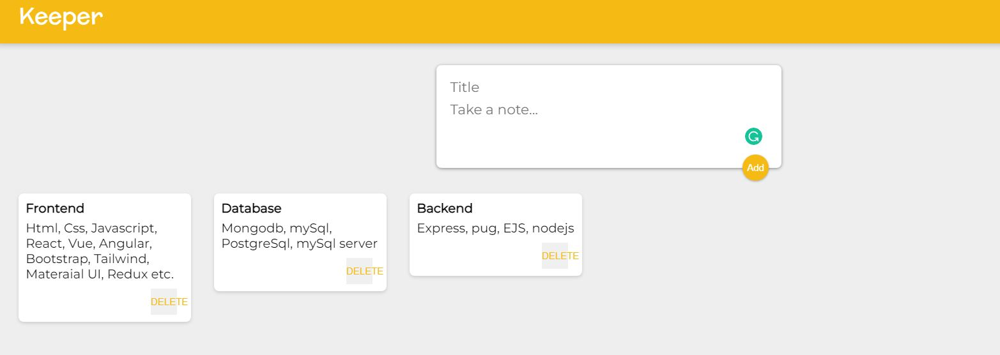

# ⭐ Project - Notes Keeper App⭐

This project of javascript is made from pure HTML,CSS and Javascript.

## Links

[Live](https://www.pratyushnoteskeeperapp.netlify.app)

[Linkedin](https://www.linkedin.com/in/pratyush-kesarwani-2b6601171/)

 

📌 Learnings:

👉 1\. React basics - Installations, files setup 
👉 2\. useState() hook 
👉 3\. Javascript ES6 concepts like Destructuring , Spread operators and High order functions like filter, map, reduce, find 

 

> Time taken to build this project is 2hr.

 
 

### Acknowledgements:

I am thankful to Hitesh Choudhary sir, Anurag sir and iNeuron team for this amazing bootcamp.
I am also thankful to Angela Yu from Web Developement Bootcamp Udemy for guidance of this project.
